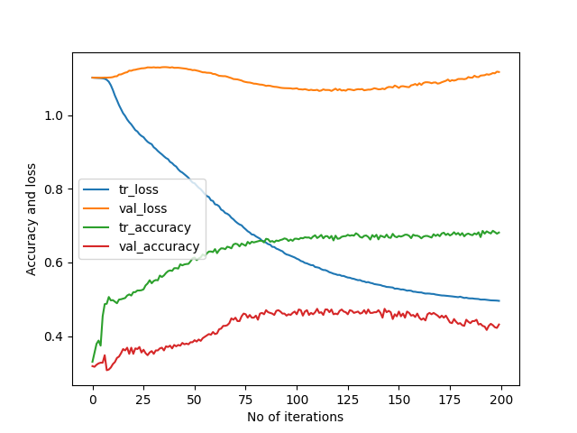

# MotorImagery-1

# DrivingDirection-80.8  
Epoch 200: val_accuracy did not improve from 0.47407    
121/121 [==============================] - 0s 3ms/step - loss: 0.4957 - accuracy: 0.6811 - val_loss: 1.1168 - val_accuracy: 0.4315    
[[ 58  27 114]    
 [ 14  94  63]    
 [ 62  27  81]]    
121/121 [==============================] - 0s 784us/step - loss: 0.5761 - accuracy: 0.6667   
17/17 [==============================] - 0s 1ms/step - loss: 1.0684 - accuracy: 0.4741       
Train: 0.667, Test: 0.474    
[[ 73  29  97]                  
 [ 24 101  46]               
 [ 59  29  82]]              

